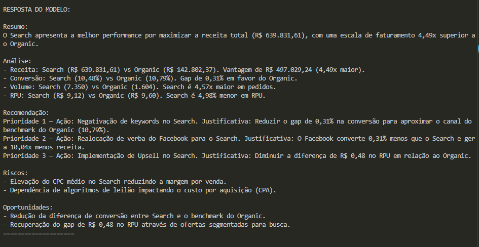

# 🤖 Agente analista de mídia de IA (MVP)

🌎 Este arquivo README também está disponível em inglês: [README.md](./README.md)

## Visão Geral

Este projeto implementa um **Agente de IA Autônomo** que atua como um **Analista Júnior de Mídia**, especializado em e-commerce. Ele é capaz de interpretar questões de negócios em linguagem natural, consultar dados reais de canais de aquisição e transformar métricas complexas em insights acionáveis e estruturados para a tomada de decisão.

**Stack: Python | FastAPI | LangGraph | BigQuery | Groq/OpenAI**

---

## O agente:

* Entende a intenção da pergunta (descritiva vs analítica)
* Decide quando consultar dados reais (BigQuery)
* Processa métricas de negócio
* Retorna **insights acionáveis**, não apenas números

---

## Objetivo do Case

Resolver o problema de negócio:

> Analistas perdem tempo cruzando dados de tráfego e vendas para entender o ROI por canal.

## Solução

Este agente automatiza todo o fluxo de trabalho:

* **Entende perguntas em linguagem natural**
* **Consulta direta (dados reais) ao Data Warehouse (BigQuery)**
* **Interpretação inteligente via LLM**
* **Processa métricas (conversão, receita, volume)**
* **Fornece insights de negócios estruturados**
* **Saída padronizada para tomada de decisão**

---

## Principais recursos

- ✅ Compreensão de linguagem natural
- ✅ Chamada de ferramentas em tempo real (BigQuery)
- ✅ Agente de múltiplas etapas (LangGraph)
- ✅ Raciocínio analítico versus descritivo
- ✅ Saída orientada a negócios (não dados brutos)
- ✅ Arquitetura limpa

---

## Arquitetura da Solução

Este projeto utiliza um **pipeline de agente baseado em LangGraph**.

### Fluxo do Agente

```
Pergunta do usuário
↓
API (FastAPI): Interface de entrada da requisição.
↓
Classificador: Identifica a intenção (Descritiva vs. Analítica).
↓
Tool Calling (BigQuery): Execução de consultas em dados reais.
↓
Gerador de Resposta (LLM): Sintetiza os dados em linguagem natural.
↓
Entrega: Resposta estruturada e orientada à decisão.

```

### Componentes

#### 1. **Orquestração (LangGraph)**

Responsável pelo fluxo do agente:

* `classify_question` → define o modo (descritivo vs analítico)
* `fetch_data` → chama BigQuery
* `generate_response` → chama LLM

---

#### 2. **LLM (Groq / OpenAI compatível)**

Responsável por:

* interpretar dados
* aplicar regras de negócio
* gerar resposta final

---

#### 3. **Tool Calling (BigQuery)**

Tool criada:

```python
get_media_data()
```

Responsável por:

* consultar dataset real
* agregar métricas por canal

---

#### 4. **Prompts Especializados**

Separação clara:

* `descriptive_prompt.py` → respostas objetivas (volume)
* `analytic_prompt.py` → respostas estratégicas (performance)

👉 Isso evita:

* confusão de contexto
* respostas inconsistentes

---

## Estrutura do Projeto

```
app/
│
├── agent/
│   ├── graph.py                # Orquestração do fluxo (LangGraph)
│   ├── nodes.py                # Lógica das etapas do agente
│   └── state.py                # Definição do estado do agente
│
├── api/
│   └── routes.py               # Endpoints da API (FastAPI)
│
├── config/
│   └── settings.py             # Gestão de variáveis de ambiente e chaves
│
├── core/
│   └── llm.py                  # Inicialização e config do modelo de linguagem
│
├── prompts/
│   ├── analytic_prompt.py      # Prompts para análise de dados
│   └── descriptive_prompt.py   # Prompts para respostas narrativas
│
├── schemas/
│   └── query_schema.py         # Modelos de dados (Pydantic)
│
├── services/
│   ├── bq_service.py           # Conexão direta com Google BigQuery
│   └── formatter.py            # Tratamento e limpeza de dados
│
├── tools/
│   └── bigquery_tool.py        # Ferramenta para o agente usar o BigQuery
│
├── validators/
│   └── validator.py            # Validações lógicas e de segurança
│
└── main.py                     # Ponto de entrada da aplicação

```

## Query BigQuery

A query utilizada agrega dados reais dos últimos 30 dias:

* usuários por canal
* pedidos
* receita
* conversão
* receita por usuário

Principais tabelas:

* `users`
* `orders`
* `order_items`

### Por que usar ferramentas?

Para garantir:
- Ausência de dados distorcidos
- Insights em tempo real
- Separação de responsabilidades (LLM ≠ Camada de dados)

---

## Setup do Projeto

### 1. Clone o repositório

```bash
git clone https://github.com/seu-usuario/ai-media-analyst-agent
cd ai-media-analyst-agent
```

### 2. Crie o ambiente virtual

```bash
python -m venv .venv
source .venv/bin/activate  # Linux/Mac
.venv\Scripts\activate     # Windows
```

### 3. Instale as dependências

```bash
pip install -r requirements.txt
```

---

### 4. Configuração de variáveis de ambiente

Crie um `.env`:

```env
GROQ_API_KEY=your_api_key_here
GOOGLE_APPLICATION_CREDENTIALS=path/to/credentials.json
```

---

### 5. Configurar Google Cloud

* Criar projeto no GCP
* Ativar BigQuery API
* Criar Service Account
* Baixar JSON de credenciais
* Definir variável:

```bash
export GOOGLE_APPLICATION_CREDENTIALS="caminho/credenciais.json"

Certifique-se de que o caminho no seu .env aponta para o arquivo JSON de credenciais baixado.
```

### 6. Rodar a aplicação

```bash
uvicorn app.main:app --reload
```
🚀 Live Demo: http://localhost:8000/docs
---

## Uso da API

### Endpoint:

```
POST /ask
```

### Exemplo:

```json
{
  "question": "Qual dos canais tem a melhor performance? E por que?"
}
```

## Exemplos de Perguntas

### 🔹 Descritiva

* "Como foi o volume de usuários vindos de 'Search' no último mês?"

### 🔹 Analítica

* "Qual canal performa melhor?"
* "Onde devo investir mais?"

---

## Exemplo de Resposta

```
Resumo:
O Search apresenta a melhor performance por maximizar a receita total...

Análise:
- Receita: ...
- Conversão: ...
- Volume: ...
- RPU: ...

Recomendação:
...

Riscos:
...

Oportunidades:
...



```

## Decisões Técnicas Importantes

### ✔ Separação de prompts

Evita ambiguidade e melhora precisão.

---

### ✔ Tool Calling (obrigatório no case)

O agente decide quando buscar dados — não é um prompt estático.

---

### ✔ Query otimizada

* uso de `COUNT DISTINCT`
* `SAFE_DIVIDE`
* filtro por últimos 30 dias

---

### ✔ Validação de saída

* padronização de formato
* controle de regras (ex: uso de múltiplos vs %)

---

## Diferenciais da Solução

* **Arquitetura real de agente (não prompt gigante)**
* Integração com dados reais (BigQuery)
* Respostas com **insight de negócio**
* Separação clara de responsabilidades
* Pronto para escalar (novas tools, novos datasets)

---

## Próximos Passos (Evolução)

- Adicionar memória (histórico de perguntas)
- Implementar múltiplas tools (ex: CAC, LTV, análise de coorte)
- Dashboard integrado
- Validação automática de respostas (LLM-as-judge)
- Implementar seleção dinâmica de ferramentas com base na intenção do usuário
- Tratamento de erros robusto (retry / fallback)
- Implementar testes automatizados (pytest)
- Suporte a perguntas fora do escopo

---

## Autor

Desenvolvido como solução para case técnico de **AI + Data + Growth**.

---

## Conclusão

Este projeto demonstra:

* domínio de arquitetura de agentes
* integração com dados reais
* capacidade de transformar dados em decisão

👉 Não é apenas um chatbot — é um **analista de mídia automatizado**.

---

## License

This project is licensed under the MIT License - see the [LICENSE](LICENSE) file for details.
